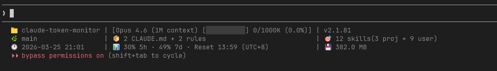

# Claude Token Monitor

[](https://github.com/young1lin/claude-token-monitor)
[](https://golang.org/)
[](LICENSE)
[](https://github.com/young1lin/claude-token-monitor/releases)
[](https://codecov.io/gh/young1lin/claude-token-monitor)
[](https://goreportcard.com/report/github.com/young1lin/claude-token-monitor)
[](https://github.com/young1lin/claude-token-monitor/actions/workflows/test.yml)
[](https://github.com/young1lin/claude-token-monitor/releases)
[](https://github.com/young1lin/claude-token-monitor/releases)

Claude Code 实时 Token 使用状态栏插件。



## 安装

```bash
/plugin marketplace add young1lin/claude-token-monitor
/plugin install claude-token-monitor@claude-token-monitor
/claude-token-monitor:setup
```

## 配置

在项目中创建 `.claude/statusline.yaml`：

```yaml
display:
  singleLine: false  # Single-line mode
  hide:              # Hide items
    - claude-version
    - memory-files

format:
  progressBar: braille  # "braille" or "ascii"
  timeFormat: 24h       # "12h" or "24h"
  compact: false

content:
  composers:
    - name: my-token
      input: [model, token-bar]
      format: "[{{.model}} {{.token-bar}}]"
  use:
    token: my-token
```

## 扩展开发

在 `internal/statusline/content/` 中创建新的收集器：

```go
type MyCollector struct {
    *content.BaseCollector
}

func (c *MyCollector) Collect(input, summary) (string, error) {
    return "my data", nil
}
```

在 `main.go` 中注册，并在 `layout/grid.go` 中添加到布局。

## 工作原理

状态栏插件采用**无状态 stdin/stdout** 执行模型。Claude Code 每次刷新时启动插件子进程，通过 stdin 写入 JSON 数据，从 stdout 读取格式化后的状态文本。

```
+-------------------+          +--------------------+          +------------------+
|                   |  spawn   |                    |  exit 0  |                  |
|    Claude Code    +--------->|   statusline.exe   +--------->|   Process Ends   |
|   (main process)  |          |  (child process)   |          |   (cleanup)      |
|                   |          |                    |          |                  |
+--------+----------+          +----+----------+----+          +------------------+
         |                          |          |
         |  stdin (JSON)            |          |  stdout (text)
         v                          |          v
+-------------------+          +----+----------+----+
| {                 |          | Parsed output:     |
|   "cwd": "...",   |          |                    |
|   "model": {...}, |   --->   | [Model] [===---]   |
|   "context_window"|          |  75K/200K (37.5%)  |
|   ...             |          |                    |
| }                 |          +--------------------+
+-------------------+
```

### Execution Flow

```
Claude Code                          statusline.exe
    |                                      |
    |  1. Spawn process                    |
    +------------------------------------->|
    |                                      |
    |  2. Write JSON to stdin              |
    +------------------------------------->|
    |                                      |
    |                            3. Parse JSON input
    |                            4. Collect data:
    |                               - Token usage
    |                               - Git branch & status
    |                               - Tool calls (from transcript)
    |                               - Agent info
    |                               - TODO progress
    |                            5. Format output string
    |                                      |
    |  6. Read stdout                      |
    |<-------------------------------------+
    |                                      |
    |  7. Display in status bar    8. Exit |
    |                                      X
```

### Input (stdin)

Claude Code 通过 stdin 发送 JSON 数据：

```json
{
  "cwd": "C:\\Project",
  "model": {
    "display_name": "Claude Sonnet 4.5",
    "id": "claude-sonnet-4-5-20250514"
  },
  "context_window": {
    "context_window_size": 200000,
    "current_usage": {
      "input_tokens": 93,
      "output_tokens": 68,
      "cache_read_input_tokens": 103040
    }
  },
  "transcript_path": "/home/user/.claude/projects/.../session.jsonl",
  "workspace": {
    "current_dir": "C:\\Project",
    "project_dir": "C:\\Project"
  }
}
```

### Output (stdout)

插件向 stdout 输出一行或多行纯文本（可包含 ANSI 颜色代码）：

```
[Claude Sonnet 4.5] | [███░░░░░░░] 75K/200K (37.5%) | 🌿 main +12 ~3 | 🔧 5 tools
```

### Why Hot Reload Works

由于插件**每次刷新都重新启动**，重新编译二进制文件后立即生效——无需重启 Claude Code。

```
  Time ─────────────────────────────────────────────────>

  v1.0 on disk          go build (v2.0)       v2.0 on disk
  ─────────────────────────┬──────────────────────────────
                           |
  Refresh #1               |          Refresh #2
  spawns v1.0              |          spawns v2.0
  ┌──────┐                 |          ┌──────┐
  │ v1.0 │ -> output       |          │ v2.0 │ -> new output
  └──────┘                 |          └──────┘
```

### Design Principles

1. **Stateless** — No persistent process, no IPC, no sockets. Each invocation is independent.
2. **Fast** — Startup time under 10ms. No network calls. Reads only the tail of transcript files.
3. **Safe** — A crash in the plugin does not affect Claude Code. It simply shows no status text.
4. **Cross-platform** — Single Go binary with no external dependencies.

### Debugging with `--debug`

使用 `--debug` 参数查看 Claude Code 发送给插件的确切 JSON 数据：

```bash
# In your Claude Code settings, temporarily add --debug:
"command": "C:\\\\path\\\\to\\\\statusline.exe --debug"
```

启用 `--debug` 后，插件会将原始 JSON 输入写入二进制文件所在目录的 `statusline.debug` 文件：

```
+-------------------+       +--------------------+       +-------------------+
|                   | stdin  |                    | file  |                   |
|    Claude Code    +------->|  statusline.exe    +------>| statusline.debug  |
|                   | (JSON) |  --debug           |       | (pretty JSON)     |
+-------------------+       +--------+-----------+       +-------------------+
                                      |
                                      | stdout (normal output continues)
                                      v
                             +--------------------+
                             | [Model] [===---]   |
                             |  75K/200K (37.5%)  |
                             +--------------------+
```

调试文件包含带时间戳的格式化 JSON：

```
------------------------------------------------------------
Timestamp: 2026-02-02 17:55:00
File: C:\path\to\statusline.debug
------------------------------------------------------------

{
  "cwd": "C:\\Project",
  "model": {
    "display_name": "Claude Sonnet 4.5",
    "id": "claude-sonnet-4-5-20250514"
  },
  "context_window": {
    "context_window_size": 200000,
    "current_usage": {
      "input_tokens": 93,
      "output_tokens": 68,
      "cache_read_input_tokens": 103040
    }
  },
  "transcript_path": "...",
  "workspace": { ... }
}
------------------------------------------------------------
```

用途：
- 验证 Claude Code 实际提供的字段
- 检查 token 值是否与 `/context` 命令显示一致
- 诊断状态栏显示异常数据时的解析问题

## 更新

### 更新插件（命令和技能）

通过 marketplace 安装的用户，更新到最新版本：

```bash
/plugin update claude-token-monitor@claude-token-monitor
```

或通过 CLI：

```bash
claude plugin update claude-token-monitor@claude-token-monitor
```

**更新内容：**
- `/setup` 命令
- `/commit-push` 命令
- `/release-github` 命令
- 插件包含的其他技能或代理

**插件缓存位置：**

| 平台 | 路径 |
|------|------|
| Windows | `C:/Users/<用户名>/.claude/plugins/cache/claude-token-monitor/claude-token-monitor/<版本>/` |
| macOS | `/Users/<用户名>/.claude/plugins/cache/claude-token-monitor/claude-token-monitor/<版本>/` |
| Linux | `/home/<用户名>/.claude/plugins/cache/claude-token-monitor/claude-token-monitor/<版本>/` |

### 更新 Statusline 二进制文件

`/setup` 命令会自动处理二进制文件更新：

1. 执行 `/setup` 或 `/claude-token-monitor:setup`
2. 检查本地版本与 GitHub 最新发布版本
3. 如有新版本，自动下载并安装更新

### 手动更新二进制文件

如需手动更新：

```bash
# Check current version
~/.claude/statusline --version

# Windows (PowerShell)
Invoke-WebRequest -Uri "https://github.com/young1lin/claude-token-monitor/releases/latest/download/statusline_windows_amd64.zip" -OutFile "$env:TEMP\statusline.zip"
Expand-Archive -Path "$env:TEMP\statusline.zip" -DestinationPath "$env:USERPROFILE\.claude\" -Force
Remove-Item "$env:TEMP\statusline.zip"

# macOS
curl -L "https://github.com/young1lin/claude-token-monitor/releases/latest/download/statusline_darwin_$(uname -m | sed 's/x86_64/amd64/;s/arm64/arm64/').tar.gz" | tar -xz -C "$HOME/.claude/"

# Linux
curl -L "https://github.com/young1lin/claude-token-monitor/releases/latest/download/statusline_linux_$(uname -m | sed 's/x86_64/amd64/;s/aarch64/arm64/').tar.gz" | tar -xz -C "$HOME/.claude/"
```

### 启用自动更新

启用启动时自动更新插件：

1. 执行 `/plugin`
2. 进入 **Marketplaces** 标签页
3. 选择 `claude-token-monitor` marketplace
4. 启用 **Auto-update**

或通过 CLI：

```bash
claude plugin marketplace update claude-token-monitor --auto-update true
```

---

[English Documentation](./README.en-US.md)
